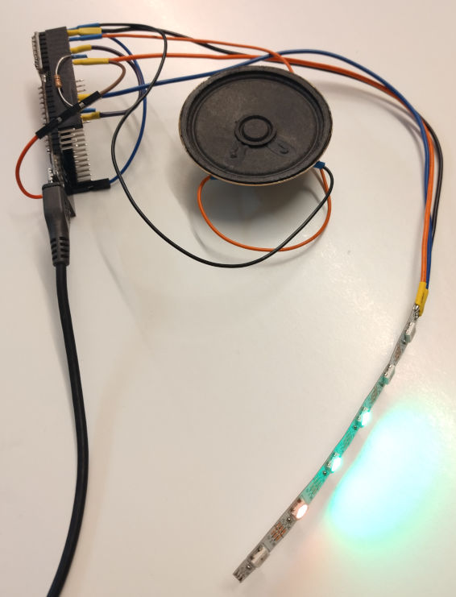

# HungerHorn

Once upon a time in a hackerspace far far away, on a Tuesday, everyone got hungry. And so it was decided to go hunt for a Pizza. The next Tuesday after that, they all got hungry again. But this time not everyone was in for the hunt right away. Apparently it was too early. Last week, so some commented, they all went at 19:00 o'clock. But yet it was just 18:55.
As social as the common hacker is, everyone waited patiently for the remaining 5 minutes before the hunt could begin. From this time on, the tradition was established. HungerTime™ is at precisely 19:00 o'clock.

Since this story is about a hackerspace, we naturally need to solve everything with technical measures. And so the project HungerHorn™ got started. It's supposed to sound an alarm signal at precisely HunterTime™. Since, nobody needs to stare at a watch the exciting minutes before.

## Getting started

### Hardware
I'm using an ESP32 board called "WeMos LOLIN32 Lite". But any ESP32 should do. For the sound output a 0.3W PC speaker and a "DF Player mini" MP3 player module with a micro SD card is used. To display the time, I'm using a short strip of 6 WS2812B RGB LEDs.

### Software
The software is written using the PlatformIO toolkit. I use Qt Creator as source code editor, but I'm sure VS Code and others will also do.

After cloning the project, execute `platformio init --board lolin32_lite --ide qtcreator` in the project directory to initialize it. Adjust the command to your hardware board and IDE of choice. Then open the code in the `src/` directory and adjust the GPIOs or whatever needed for different hardware. Call `platformio run -t upload` to install it on your board.

### 3D Print
I've used the files in the `cad/` folder to 3D-print a case for the HungerHorn™. You will have to adjust several dimensions if you don't have exactly the same speaker and LED strip. To edit the 2D .dxf contours, I use LibreCAD. and the 3D models are OpenSCAD files.
